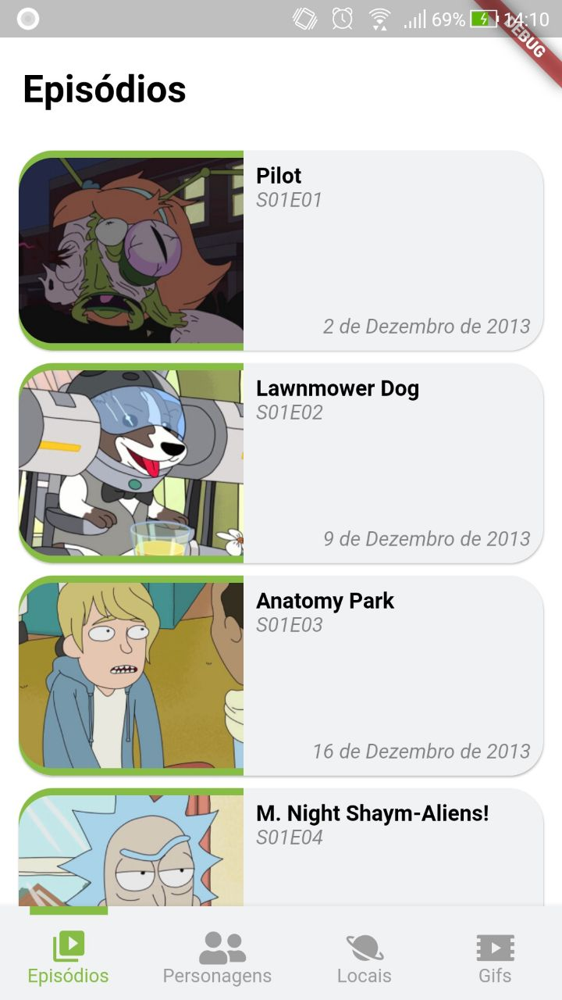
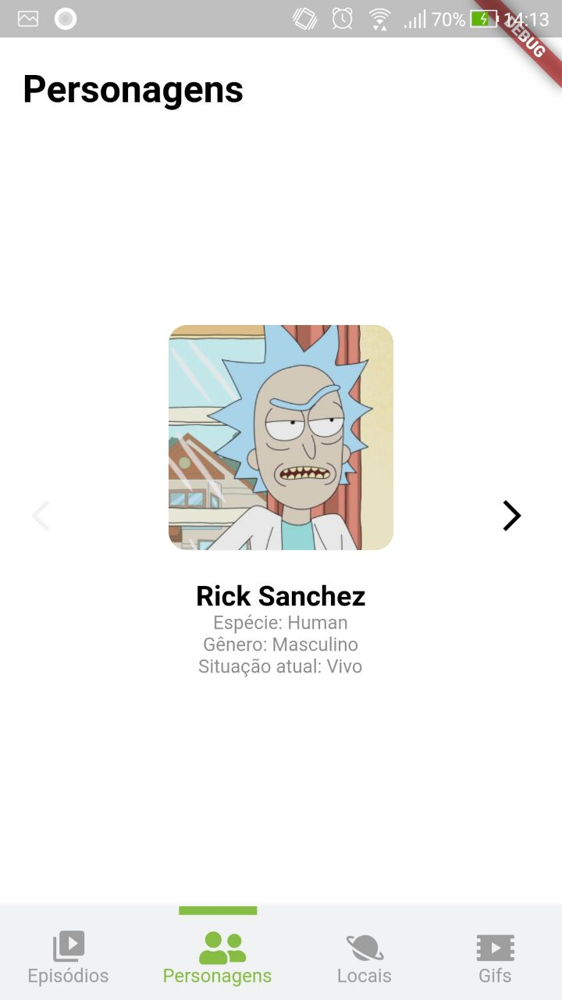
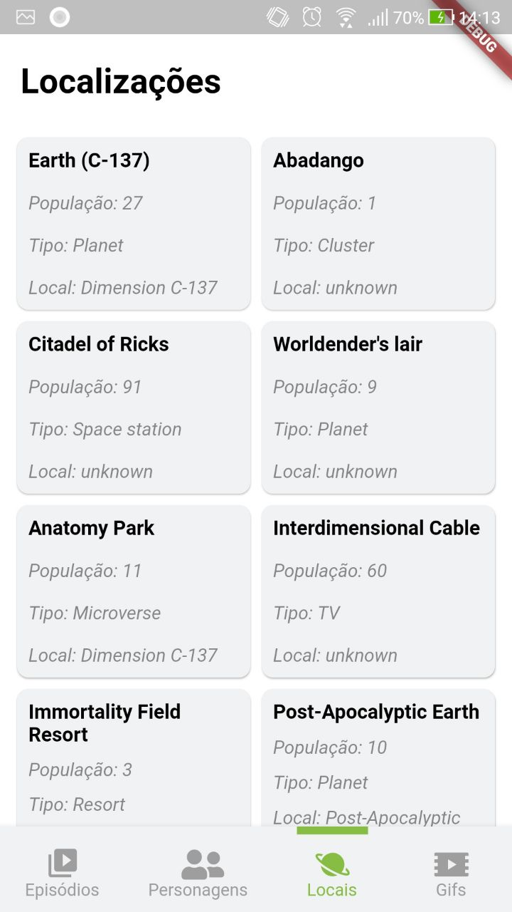
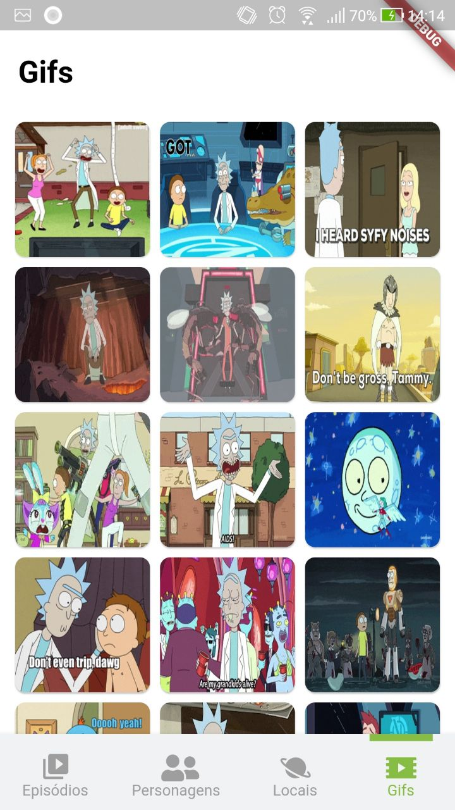
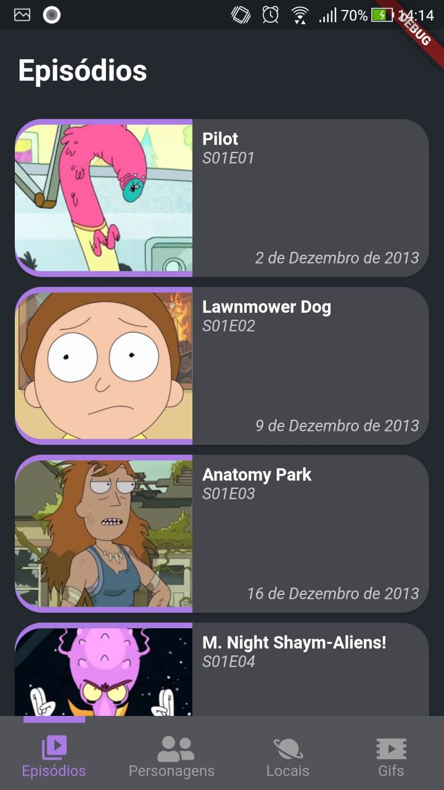
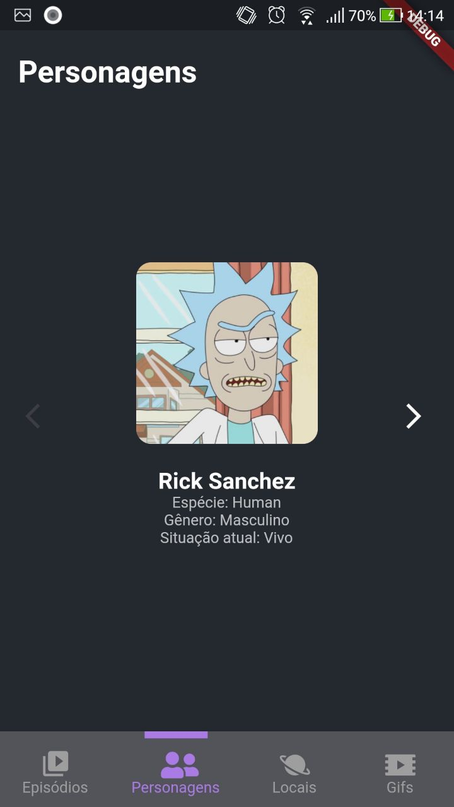
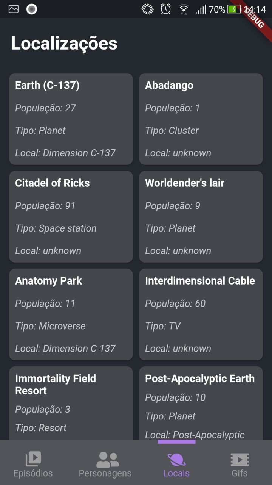
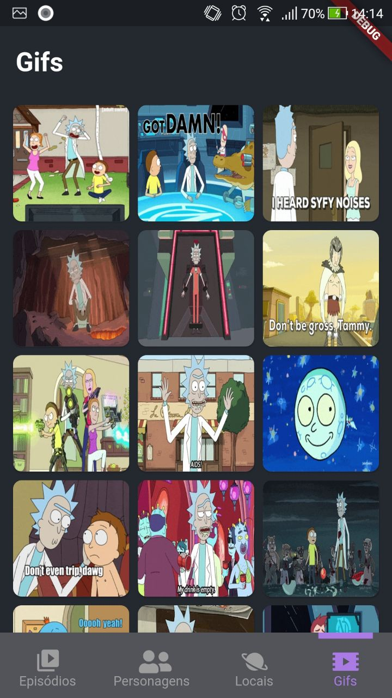

# Rick And Morty App

Um aplicativo com glossário do Rick&MortyVerso para aprender um pouco... Mas de que importa, a vida é inútil e todos vamos morrer, agora me passa as torradas.

### Screenshots

    

### Also in dark mode
   

## How to Use

```
- Primeiramente, é necessário ter o flutter instalado e configurado na sua maquina

- Clone o repositório:
$ git clone https://github.com/JulioCGMC/rick_and_morty_app.git

- Entre na pasta:
$ cd rick_n_morty_app

- Instale as dependencias:
$ flutter pub get

- E rode: 
$ flutter run
```


## Disclaimer

Esse aplicativo conta com a API desenvolvida por [Axel Fuhrmann](https://axelfuhrmann.com/), para mais detalhes, veja sua documentação: https://rickandmortyapi.com/